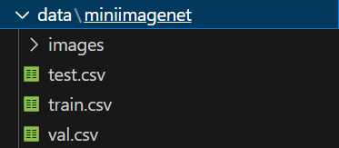

作者源代码链接如下：

https://github.com/Yikai-Wang/ICI-FSL/tree/master/V1-CVPR20

本次论文翻译代码链接：

https://github.com/polarlike/Instance-credibility-inference-

相对于初始代码修改了ici.py中ElasticNet函数用法，由于sklearn更新该函数的scaler参数被弃用，手动添加standscaler

如何使用：

```
python main.py -g 0 --resume ckpt/res12_mini.pth.tar --dataset miniimagenet
```

--resume 指定继续训练的模型默认为None 

--dataset指定使用的数据集

注意数据集要放到/data路径下

